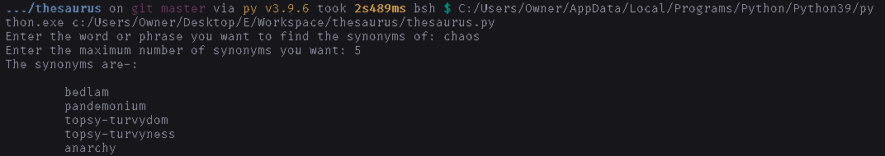

# How to use

1. Install [python](https://python.org/downloads).
2. Download [`thesaurus.py`](https://raw.githubusercontent.com/DhruvMitna/thesaurus/master/thesaurus.py).
3. Open the downloads folder and open `thesaurus.py`.

### An example

